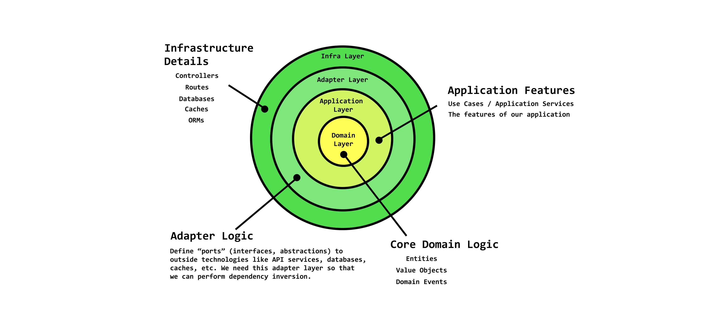

<p align="center">
 
</p>
<h1 align="center">Loadlink</h1>

> A light weight load shipping platform built with TypeScript using the clean architecture and Domain Driven Design and SOLID principles.


## About

LoadLink aims to address the high cost of shipping for small and lightweight goods, making it more affordable for both vendors and customers. LoadLink achieves this by connecting travelers who are embarking on journeys with available space to vendors in need of cost-effective shipping solutions. Travelers can carry goods for vendors during their trips, reducing shipping costs significantly.

## Running the project

1. Fork the this repositiry and clone your forked version of the repo.

2. `cd` into the repository folder.

3. Copy the `.env` example file. Supply the neccessary details, feel free to change passwords and app secrets.

```bash
cp .env.example .env
```

4. Install dependencies.

```bash
npm install
```

5. Start the project in dev mode with:

```bash
npm run dev
```

You can visit the app by going to `http://localhost:3000`.

### Demo

[You can visit the site here](https://loadlink.up.railway.app/).

> `Note`: This project is currently under active development, and additional features and improvements will be added.

### Built with

#### Backend

- Node.js
- Mongoose - The Object Data Modeling (ODM) library for MongoDB
- Express.js - Lightweight webserver
- Redis - For holding onto JWT tokens and refresh tokens

#### Frontend

- Javascript
- HTML
- CSS

### Architecture

To separate concerns, the application was built with a Clean Architecture. It is divided into Domain, Application, Infrastructure layers and the User Interface which constitute part of the frontend.

**Clean Architecture**: This architecture ensures a clear separation of logic, preventing the mixing of infrastructure and domain code. It enhances maintainability and scalability.



**DDD**: DDD divides our application into subdomains, focusing on core concepts and their related concerns, promoting a cohesive codebase for better organization.

#### User Subdomain

The User subdomain focuses on user-related concepts, including authentication, roles, identity, access management, and more. Here are some of the key concepts that will exist within this subdomain at each architectural layer:

- **Domain Layer**:

  - User (Aggregate Root)
  - UserEmail (Value Object)
  - UserCreated (Domain Event)

- **Application Layer**:

  - CreateUserUseCase (Use Case)
  - GetUserByUserName (Use Case)

- **Adapter Layer**:

  - IUserRepo (Repository Interface Adapter)

- **Infrastructure Layer**:
  - MongooseUserRepo (Concrete Implementation using Mongoose)
  - UserDTO (Data Transmission Objects)

#### Shipping Subdomain

The Shipping subdomain is primarily concerned with the process of creating shipments and shipping products. The concepts within this subdomain do not overlap with those in the User subdomain. Here are some key concepts related to the Shipping subdomain:

- **Domain Layer**:

  - Sender (or Vendor)
  - Traveler
  - Shipment
  - Location

- **Application Layer**:

  - CreateShipmentUseCase (Use Case)
  - ShipProductUseCase (Use Case)
  - FindTravelersForShipmentUseCase (Use Case)

- **Adapter Layer**:

  - ISenderRepo (Repository Interface Adapter)
  - ITravelerRepo (Repository Interface Adapter)
  - IShipmentRepo (Repository Interface Adapter)
  - ILocationRepo (Repository Interface Adapter)

- **Infrastructure Layer**:
  - MongooseSenderRepo (Concrete Implementation using Mongoose)
  - MongooseTravelerRepo (Concrete Implementation using Mongoose)
  - MongooseShipmentRepo (Concrete Implementation using Mongoose)
  - MongooseLocationRepo (Concrete Implementation using Mongoose)

### APIs

- **/users**

  - **/api/v1/users**
    - POST: Create a new user account.
      - Description: Clients can use this endpoint to register new users in the system.
  - **/api/v1/users/me**
    - GET: Allow users to login
      - Description: This endpoint allows you to login to your account.
  - **/api/v1/users/login**
    - POST: Create a new user account.
      - Description: Clients can use this endpoint to register new users in the system.

- **/travelers**

  - **/api/v1/travelers**
    - GET: Retrieve a list of available travelers.
      - Description: Clients can request a list of travelers who are available for shipping.
  - **/api/v1/travelers/pair**
    - POST: Connect a user with a traveler for shipping.
      - Description: Users can create shipping requests and connect with travelers for the transportation of goods.

- **/shipments**

  - **/api/v1/shipments**
    - POST: Create a shipment.
      - Description: Travelers can create shipments after accepting requests for shipping.
  - **/api/v1/shipments**
    - GET: Retrieve a list of available shipments.
      - Description: Users and Travelers can request a list of the shipments they created.
  - **/api/v1/shipments/cancel**
    - POST: Cancel a shipment.
      - Description: Users can cancel shipments before the journey starts.
  - **/api/v1/shipments/received**
    - POST: Mark shipment as delivered.
      - Description: Users can mark a shipment as delivered after goods have been received.

- **/locations**

  - **/api/v1/location**
    - POST: Receive geolocation data from travelers.
      - Description: Travelers can update the current location of the shipment.
  - **GET: Get location history.**

    - Description: This endpoint provides a list of the major locations of the shipment.

## DDD Data Models

Incorporate your updated data model to reflect DDD and Clean Architecture:

### Entities:

- User
- Traveler
- Shipment
- Location

### Value Objects:

- UserName
- UserEmail
- UserId
- UserPassword
- Latitude
- Longitude
- Description
- AccountNumber
- BankName
- Amount

## User Stories

### User Story 1: User Registration

As a user, I want to create an account on LoadLink to access its features.

### User Story 2: Find a Traveler

As a user, I want to search for available travelers who can transport my goods, specifying the destination, pickup, and delivery times.

### User Story 3: Accept request

As a traveler, I want to view and accept shipping requests from users for trips I plan to make.

### User Story 4: View Shipping History

As a user, I want to see my shipping history, including past shipments, to keep track of my transactions.

## Initial mockup for mobile screens

<p align="center">
  
  
  
</p>

## Contributing

Contributions are welcome! Open issues, bugs, and enhancements are all listed on the issues tab and labeled accordingly. Feel free to open bug tickets and make feature requests.

## Contributors ✨

Below is the list of people who has made contributions to the this repo:

<table>
  <tr>
    <td align="center"><a href="https://www.linkedin.com/in/bobson-prosper-paebi"><br /><sub><b>Bobson Prosper</b></sub></a><br /><a href="#" title="Code">💻</a></td>
  </tr>
</table>
